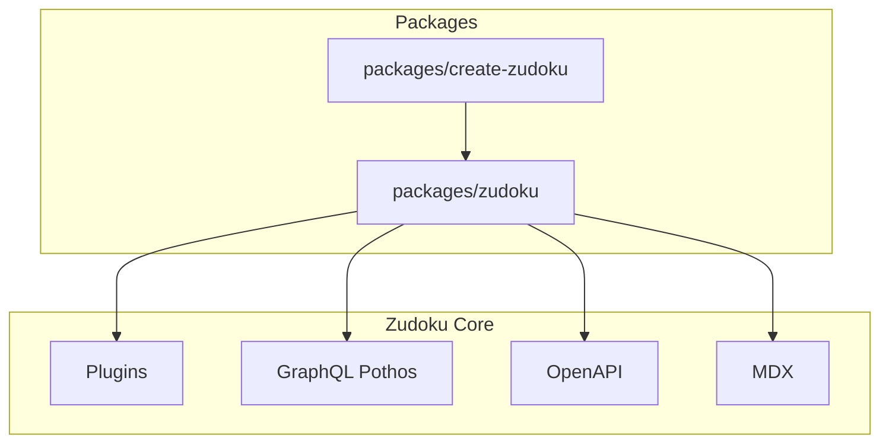

# Architecture — zudoku

Zudoku is a documentation and API catalog framework built with React, Vite, and a plugin-based
architecture.

## System context

## Tech stack

- React 19+, Vite, TypeScript, TailwindCSS
- React Router 7, TanStack Query, Radix UI, Zod
- GraphQL (Pothos + GraphQL Yoga) for OpenAPI structuring
- MDX for docs

## See also

- [pages/docs/](pages/docs/) — Configuration and guides
- [FEATURE_ROADMAP.md](FEATURE_ROADMAP.md)
