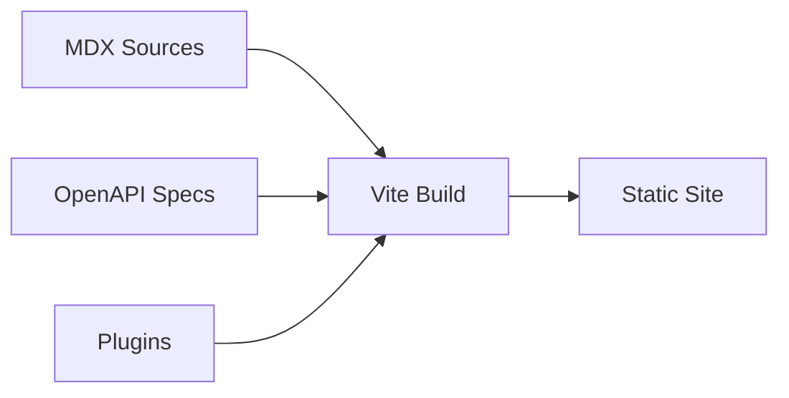

# Data flow — zudoku

Doc generation, API catalog, and plugin data flow.

## Doc generation flow

## API catalog flow

- OpenAPI documents are ingested and structured via GraphQL.
- Plugins extend behavior (openapi, markdown, api-keys, search).
- Static output is served (Cloudflare Pages, etc.).

## See also

- [RUNBOOK.md](RUNBOOK.md)
- [pages/docs/](pages/docs/)
