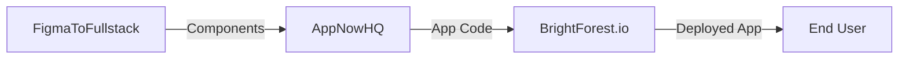

# Available MCP Agents

BrightForest provides **13 specialized MCP agents** across our ecosystem, each designed to handle
specific domains with deep expertise and optimized tooling.

<Info>
  **Status**: All agents are currently in preview/development. Check individual agent pages for
  current availability and capabilities.
</Info>

## Platform & Infrastructure

### BrightForest.io - Platform Integration Agent

<Badge variant="warning">Coming Soon</Badge>

Orchestrates CI/CD pipelines, manages deployment workflows, and automates infrastructure
provisioning across the BrightForest platform.

**Key Capabilities**: Deployment automation, pipeline orchestration, infrastructure management

[Learn more →](/docs/mcp/agents/brightforest-io)

---

### BrightForestX.com - Enterprise Configuration Agent

<Badge variant="warning">Coming Soon</Badge>

Manages multi-tenant configurations, SLA monitoring, and enterprise-grade settings for large-scale
deployments.

**Key Capabilities**: Multi-tenant setup, SLA management, compliance configuration

[Learn more →](/docs/mcp/agents/brightforestx-com)

---

## AI & Machine Learning

### BrightPath.ai - AI Model Orchestration Agent

<Badge variant="warning">Coming Soon</Badge>

Helps select optimal AI models, design inference pipelines, and manage model lifecycle across
different deployment targets.

**Key Capabilities**: Model selection, pipeline design, inference optimization

[Learn more →](/docs/mcp/agents/brightpath-ai)

---

### PathX.ai - Algorithm Optimization Agent

<Badge variant="warning">Coming Soon</Badge>

Runs benchmarks, tunes hyperparameters, and optimizes algorithm performance for machine learning and
data processing workflows.

**Key Capabilities**: Benchmark automation, parameter tuning, performance profiling

[Learn more →](/docs/mcp/agents/pathx-ai)

---

### BrightForest.ai - MLOps Agent

<Badge variant="warning">Coming Soon</Badge>

Manages end-to-end MLOps workflows including model deployment, monitoring, data pipeline
orchestration, and experiment tracking.

**Key Capabilities**: Model deployment, data pipelines, experiment management

[Learn more →](/docs/mcp/agents/brightforest-ai)

---

### MLNinjas.com - ML Training Agent

<Badge variant="warning">Coming Soon</Badge>

Coordinates distributed training jobs, tracks experiments, searches hyperparameter spaces, and
manages training artifacts.

**Key Capabilities**: Experiment tracking, hyperparameter search, distributed training

[Learn more →](/docs/mcp/agents/mlninjas-com)

---

## Design & Development

### FigmaToFullstack.com - Design-to-Code Agent

<Badge variant="warning">Coming Soon</Badge>

Exports Figma designs, generates React/Vue/Angular components, and maintains design system
consistency in code.

**Key Capabilities**: Figma export, component generation, design system sync

[Learn more →](/docs/mcp/agents/figmatofullstack-com)

---

### FigmaToFullstack.ai - AI Design Assistant

<Badge variant="warning">Coming Soon</Badge>

Provides intelligent layout suggestions, runs accessibility audits, and recommends design
improvements using AI.

**Key Capabilities**: Layout optimization, accessibility checks, design recommendations

[Learn more →](/docs/mcp/agents/figmatofullstack-ai)

---

### AppNowHQ.com - App Builder Agent

<Badge variant="warning">Coming Soon</Badge>

Scaffolds full-stack applications, generates boilerplate code, and automates deployment pipelines
for new projects.

**Key Capabilities**: Project scaffolding, deployment automation, boilerplate generation

[Learn more →](/docs/mcp/agents/appnowhq-com)

---

## Automation & RPA

### GetDIYRPA.com - RPA Workflow Agent

<Badge variant="warning">Coming Soon</Badge>

Builds automation recipes, creates integration connectors, and orchestrates robotic process
automation workflows.

**Key Capabilities**: Workflow builder, integration connectors, automation recipes

[Learn more →](/docs/mcp/agents/getdiyrpa-com)

---

### GetDIYAI.com - DIY AI Builder Agent

<Badge variant="warning">Coming Soon</Badge>

Helps users select AI templates, configure models, and deploy custom AI solutions without deep ML
expertise.

**Key Capabilities**: Template selection, model configuration, no-code AI deployment

[Learn more →](/docs/mcp/agents/getdiyai-com)

---

## Portfolio & Learning

### CliffordDalsonIII.com - Portfolio Management Agent

<Badge variant="warning">Coming Soon</Badge>

Manages project showcases, generates portfolio content, and operates CMS for personal branding
websites.

**Key Capabilities**: Project showcase, blog CMS, portfolio generation

[Learn more →](/docs/mcp/agents/clifforddalsoniii-com)

---

### IHeartAI.ai - AI Learning Agent

<Badge variant="warning">Coming Soon</Badge>

Recommends tutorials, guides learners through AI projects, and provides personalized learning paths
for AI education.

**Key Capabilities**: Tutorial recommendations, project guidance, learning path curation

[Learn more →](/docs/mcp/agents/iheartai-ai)

---

## Getting Started

Ready to connect to BrightForest MCP agents? Follow our
[Getting Started guide](/docs/mcp/getting-started) to configure your AI client.

## Agent Selection Guide

Not sure which agent to use? Here's a quick reference:

| Use Case                     | Recommended Agent     |
| ---------------------------- | --------------------- |
| Deploy applications          | BrightForest.io       |
| Configure enterprise systems | BrightForestX.com     |
| Design ML pipelines          | BrightPath.ai         |
| Optimize algorithms          | PathX.ai              |
| Convert designs to code      | FigmaToFullstack.com  |
| Improve UI/UX                | FigmaToFullstack.ai   |
| Train ML models              | MLNinjas.com          |
| Manage portfolio site        | CliffordDalsonIII.com |
| Build AI apps (no-code)      | GetDIYAI.com          |
| Automate workflows           | GetDIYRPA.com         |
| Scaffold new apps            | AppNowHQ.com          |
| Deploy ML models             | BrightForest.ai       |
| Learn AI concepts            | IHeartAI.ai           |

## Multi-Agent Workflows

You can combine multiple BrightForest agents in a single workflow:

**Example**: Use FigmaToFullstack to generate components from designs, AppNowHQ to scaffold the
application structure, and BrightForest.io to deploy the final app.

## Support & Feedback

Have questions or feedback about our MCP agents?

- Join our [Discord Community](https://discord.brightforest.io)
- Report issues on [GitHub](https://github.com/brightforest/mcp-servers)
- Email us at [mcp@brightforest.io](mailto:mcp@brightforest.io)
