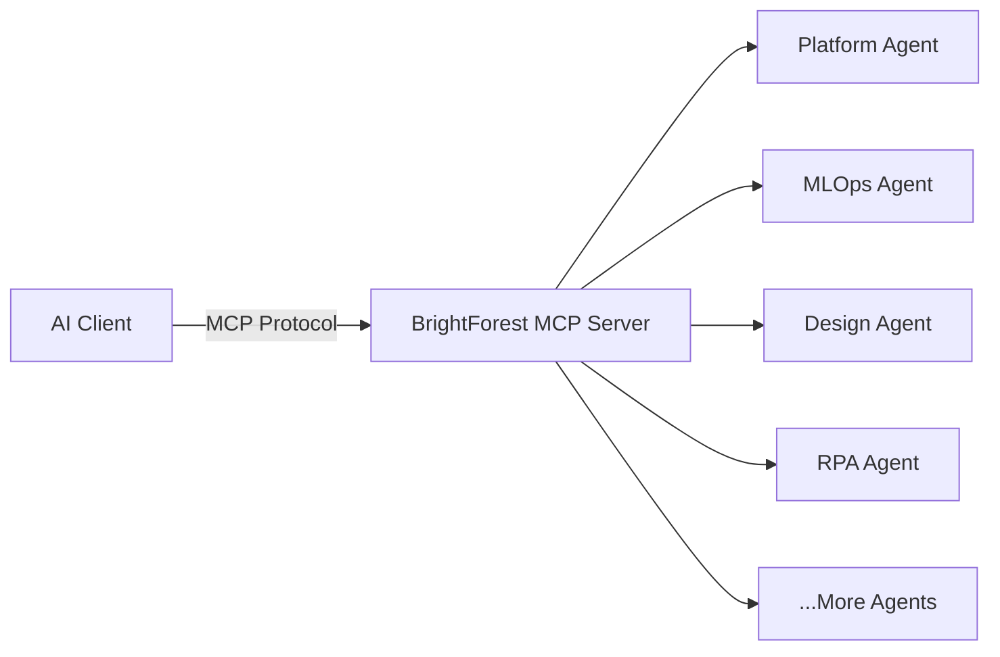

# What is Model Context Protocol?

The **Model Context Protocol (MCP)** is an open standard that enables AI applications to securely
connect with external data sources and tools. Think of it as a universal adapter that lets AI
assistants like Claude, ChatGPT, and others interact with your systems in a standardized way.

## How BrightForest Uses MCP

BrightForest leverages MCP to expose **domain-specific AI agent capabilities** across our ecosystem
of products and services. Each BrightForest domain provides specialized agents that understand the
unique requirements and workflows of that particular area.

### Key Benefits

- **Specialized Knowledge**: Each agent is trained on domain-specific patterns, APIs, and best
  practices
- **Seamless Integration**: Connect any MCP-compatible AI client to BrightForest agents
- **Secure Access**: Fine-grained permissions and authentication for each agent connection
- **Extensible**: Add custom tools and capabilities to agents as your needs evolve

## BrightForest MCP Architecture

Each agent provides:

- **Resources**: Access to domain-specific data, documentation, and configurations
- **Tools**: Executable functions for automation, deployment, and orchestration
- **Prompts**: Pre-built templates optimized for common workflows

## Available Agent Domains

BrightForest offers specialized MCP agents across multiple domains. Each agent provides unique
capabilities tailored to its domain:

  <AgentCapability
    name="FigmaToFullStack"
    agentType="Figma to Full-Stack Code Generator"
    domain="figmatofullstack.ai / figmatofullstack.com"
    capabilities={[
      "Convert Figma designs to production-ready code",
      "Support for React, Vue, and Angular frameworks",
      "Responsive design generation",
      "Component library integration",
    ]}
  />
  <AgentCapability
    name="BrightForest AI"
    agentType="AI-Powered Development Assistant"
    domain="brightforest.ai / brightforest.io"
    capabilities={[
      "Code generation and refactoring",
      "Documentation generation",
      "Test case creation",
      "Performance optimization suggestions",
    ]}
  />
  <AgentCapability
    name="BrightForestX"
    agentType="Advanced Development Platform"
    domain="brightforestx.com"
    capabilities={[
      "Multi-language code generation",
      "Architecture design assistance",
      "Code review and analysis",
      "Integration with popular IDEs",
    ]}
  />
  <AgentCapability
    name="BrightPath"
    agentType="Learning Path Generator"
    domain="brightpath.ai"
    capabilities={[
      "Personalized learning recommendations",
      "Skill assessment and tracking",
      "Interactive tutorials",
      "Progress analytics",
    ]}
  />
  <AgentCapability
    name="PathX"
    agentType="Career Navigation Assistant"
    domain="pathx.ai"
    capabilities={[
      "Career path recommendations",
      "Skill gap analysis",
      "Job market insights",
      "Interview preparation",
    ]}
  />
  <AgentCapability
    name="iHeartAI"
    agentType="AI Companion and Assistant"
    domain="iheartai.ai"
    capabilities={[
      "Natural language understanding",
      "Task automation",
      "Knowledge management",
      "Personalized recommendations",
    ]}
  />
  <AgentCapability
    name="AppNow HQ"
    agentType="Rapid Application Development"
    domain="appnowhq.com"
    capabilities={[
      "No-code/Low-code development",
      "Template library",
      "Deployment automation",
      "API integration",
    ]}
  />
  <AgentCapability
    name="DIY AI"
    agentType="DIY AI Builder"
    domain="getdiyai.com"
    capabilities={[
      "Custom AI model training",
      "Pre-built AI components",
      "Data pipeline management",
      "Model deployment",
    ]}
  />
  <AgentCapability
    name="DIY RPA"
    agentType="Robotic Process Automation"
    domain="getdiyrpa.com"
    capabilities={[
      "Workflow automation",
      "Task recording and replay",
      "Integration with business apps",
      "Scheduling and monitoring",
    ]}
  />
  <AgentCapability
    name="ML Ninjas"
    agentType="Machine Learning Expert"
    domain="mlninjas.com"
    capabilities={[
      "ML model development",
      "Data preprocessing",
      "Model evaluation and tuning",
      "Production deployment",
    ]}
  />
  <AgentCapability
    name="Clifford Dalson III"
    agentType="Personal AI Assistant"
    domain="clifforddalsoniii.com"
    capabilities={[
      "Content creation",
      "Research assistance",
      "Project management",
      "Communication tools",
    ]}
  />

<Info>
  All BrightForest MCP agents are currently in **preview**. [Learn about our
  roadmap](/docs/mcp/agents) or [get started with a connection](/docs/mcp/getting-started).
</Info>

## Next Steps

<CardGroup cols={2}>
  <Card title="Getting Started" icon="play" href="/docs/mcp/getting-started">
    Connect your AI client to BrightForest MCP servers
  </Card>
  <Card title="Available Agents" icon="users" href="/docs/mcp/agents">
    Browse all specialized agents and their capabilities
  </Card>
</CardGroup>

## Learn More

- [MCP Specification](https://modelcontextprotocol.io/) - Official protocol documentation
- [Claude Desktop MCP Setup](https://docs.anthropic.com/claude/docs/model-context-protocol) - Using
  MCP with Claude
- [BrightForest Platform](https://brightforest.io) - Our core platform and ecosystem
