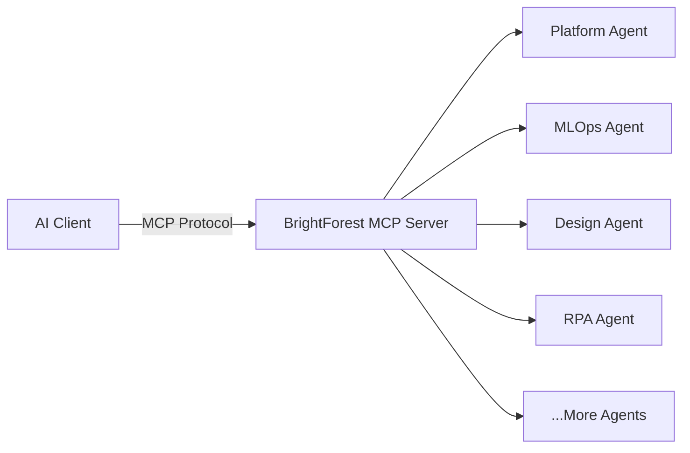

# What is Model Context Protocol?

The **Model Context Protocol (MCP)** is an open standard that enables AI applications to securely connect with external data sources and tools. Think of it as a universal adapter that lets AI assistants like Claude, ChatGPT, and others interact with your systems in a standardized way.

## How BrightForest Uses MCP

BrightForest leverages MCP to expose **domain-specific AI agent capabilities** across our ecosystem of products and services. Each BrightForest domain provides specialized agents that understand the unique requirements and workflows of that particular area.

### Key Benefits

- **Specialized Knowledge**: Each agent is trained on domain-specific patterns, APIs, and best practices
- **Seamless Integration**: Connect any MCP-compatible AI client to BrightForest agents
- **Secure Access**: Fine-grained permissions and authentication for each agent connection
- **Extensible**: Add custom tools and capabilities to agents as your needs evolve

## BrightForest MCP Architecture

Each agent provides:

- **Resources**: Access to domain-specific data, documentation, and configurations
- **Tools**: Executable functions for automation, deployment, and orchestration
- **Prompts**: Pre-built templates optimized for common workflows

## Available Agent Domains

BrightForest offers specialized MCP agents across multiple domains:

- **Platform & Infrastructure**: CI/CD, deployment orchestration, enterprise configuration
- **AI & ML Operations**: Model orchestration, training pipelines, MLOps automation
- **Design & Development**: Design-to-code workflows, component generation, scaffolding
- **Automation & RPA**: Workflow builders, integration connectors, automation recipes
- **Learning & Portfolio**: Tutorial systems, project management, content CMS

<Info>
  All BrightForest MCP agents are currently in **preview**. [Learn about our roadmap](/docs/mcp/agents) or [get started with a connection](/docs/mcp/getting-started).
</Info>

## Next Steps

<CardGroup cols={2}>
  <Card title="Getting Started" icon="play" href="/docs/mcp/getting-started">
    Connect your AI client to BrightForest MCP servers
  </Card>
  <Card title="Available Agents" icon="users" href="/docs/mcp/agents">
    Browse all specialized agents and their capabilities
  </Card>
</CardGroup>

## Learn More

- [MCP Specification](https://modelcontextprotocol.io/) - Official protocol documentation
- [Claude Desktop MCP Setup](https://docs.anthropic.com/claude/docs/model-context-protocol) - Using MCP with Claude
- [BrightForest Platform](https://brightforest.io) - Our core platform and ecosystem
