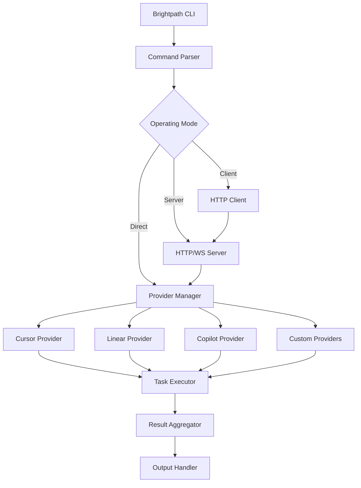

# Brightpath CLI

**Brightpath CLI** is a powerful multi-provider AI agent orchestrator that enables developers to automate complex workflows, execute batch operations, and orchestrate multi-round agent pipelines across different AI providers and platforms.

## What is Brightpath?

Brightpath is a command-line interface designed to streamline AI-powered development workflows by providing:

- **Multi-Provider Support**: Work with Cursor, Linear, Copilot, and custom providers
- **Batch Operations**: Execute multiple agent tasks in parallel or sequence
- **Multi-Round Orchestration**: Build complex DAG-based pipelines with split/merge strategies
- **Flexible Modes**: Run in direct, server, or client mode depending on your needs
- **Budget Controls**: Manage costs with fine-grained budget controls per operation

## Operating Modes

Brightpath can operate in three distinct modes:

### Direct Mode

Execute commands directly against provider APIs. Best for quick, one-off operations.

```bash
brightpath run --provider cursor --task "Update documentation"
```

### Server Mode

Run Brightpath as a long-running server that accepts requests via HTTP/WebSocket. Ideal for integrating with other tools and services.

```bash
brightpath serve --port 8080 --mode server
```

### Client Mode

Connect to a Brightpath server and execute commands remotely. Perfect for distributed workflows.

```bash
brightpath run --mode client --server http://localhost:8080 --task "Run tests"
```

## Key Features

### Batch Operations

Launch multiple agent tasks from a single batch file, monitor their progress, and merge results automatically.

```bash
# Launch a batch operation
brightpath batch launch ./my-batch.txt

# Monitor progress
brightpath batch status

# Merge completed results
brightpath batch merge
```

[Learn more about Batch Operations →](/docs/tools/brightpath/batch-operations)

### Multi-Round Orchestration

Define complex workflows with multiple stages, dependencies, and merge strategies using DAG-based pipeline configuration.

```bash
# Execute a multi-round pipeline
brightpath run --pipeline ./pipeline.yaml --budget 10.00
```

[Learn more about Multi-Round Orchestration →](/docs/tools/brightpath/multi-round)

### Provider Integration

Seamlessly integrate with multiple AI providers and platforms:

- **Cursor**: Cursor API integration for AI-powered code editing
- **Linear**: Linear issue tracking and workflow automation
- **Copilot**: GitHub Copilot integration for code generation
- **PostForMe**: Automated posting and content distribution
- **Upload-Post**: File upload and deployment automation

[Learn more about Providers →](/docs/tools/brightpath/providers)

## Architecture



## Use Cases

### Automated Code Reviews

Run comprehensive code reviews across multiple repositories using batch operations:

```bash
# Review all PRs in a batch
brightpath batch launch ./review-prs.txt --provider cursor
```

### Multi-Stage Deployments

Orchestrate complex deployment pipelines with validation, testing, and rollback strategies:

```bash
# Execute deployment pipeline
brightpath run --pipeline ./deploy-pipeline.yaml
```

### Issue Triage and Management

Automate issue triage, labeling, and assignment across Linear projects:

```bash
# Triage new issues
brightpath actions triage --provider linear --project "Backend"
```

### Documentation Generation

Generate and update documentation across multiple repositories:

```bash
# Update docs in batch
brightpath batch launch ./docs-update-batch.txt
```

## Getting Started

<CardGroup cols={2}>
  <Card title="Installation" icon="download" href="/docs/tools/brightpath/installation">
    Build from source and set up your environment
  </Card>
  <Card title="Commands" icon="terminal" href="/docs/tools/brightpath/commands">
    Complete command reference and usage examples
  </Card>
  <Card title="Batch Operations" icon="list" href="/docs/tools/brightpath/batch-operations">
    Learn how to create and execute batch operations
  </Card>
  <Card title="Providers" icon="plug" href="/docs/tools/brightpath/providers">
    Configure and use different AI providers
  </Card>
</CardGroup>

## Quick Example

Here's a quick example of using Brightpath to update documentation across multiple repositories:

```bash
# Create a batch file
cat > update-docs.txt << EOF
repo: zudoku-docs
task: Update API reference documentation
budget: 2.00

repo: my-project
task: Add installation instructions
budget: 1.50

repo: examples
task: Update example code to latest version
budget: 2.50
EOF

# Launch the batch
brightpath batch launch update-docs.txt --provider cursor

# Monitor progress
brightpath batch status

# Merge results when complete
brightpath batch merge --strategy auto
```

## Next Steps

1. [Install Brightpath](/docs/tools/brightpath/installation) and set up your environment
2. Review the [command reference](/docs/tools/brightpath/commands) to understand available commands
3. Try creating your first [batch operation](/docs/tools/brightpath/batch-operations)
4. Explore [multi-round orchestration](/docs/tools/brightpath/multi-round) for complex workflows
5. Configure your preferred [providers](/docs/tools/brightpath/providers)

## Support and Community

Need help or want to contribute?

- [GitHub Repository](https://github.com/brightforest/brightpath)
- [Discord Community](https://discord.brightforest.io)
- [Issue Tracker](https://github.com/brightforest/brightpath/issues)
- [Documentation](https://brightforest.io/docs/tools/brightpath)
