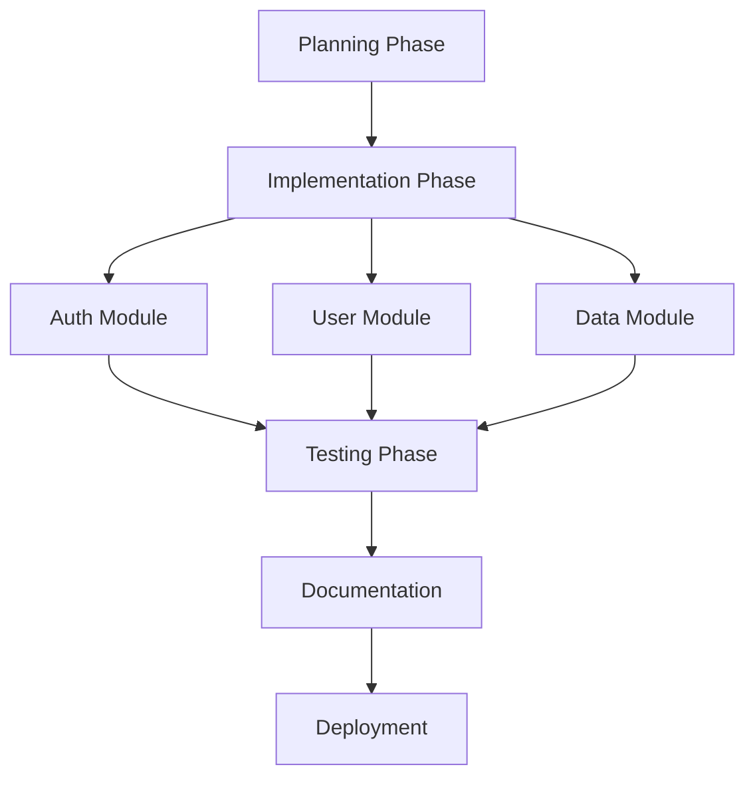

# Multi-Round Orchestration

Multi-round orchestration enables you to build complex, multi-stage AI agent pipelines where tasks are organized in a directed acyclic graph (DAG). This allows for sophisticated workflows with dependencies, parallel execution, conditional logic, and intelligent result merging.

## What is Multi-Round Orchestration?

Multi-round orchestration is a way to define and execute complex workflows that involve:

- **Multiple Rounds**: Execute tasks in sequential stages or "rounds"
- **DAG Structure**: Define dependencies between tasks using directed acyclic graphs
- **Split Strategies**: Divide work across multiple parallel agents
- **Merge Strategies**: Intelligently combine results from parallel executions
- **Budget Controls**: Manage costs across the entire pipeline
- **Checkpointing**: Save state and resume from failures

## Pipeline Definition

Pipelines are defined in YAML format with a clear structure for rounds, tasks, and dependencies.

### Basic Pipeline Structure

```yaml
name: simple-pipeline
version: 1.0
budget:
  total: 50.00
  per_round: 10.00

rounds:
  - id: round-1
    name: Initial Setup
    tasks:
      - id: task-1
        task: "Initialize project structure"
        provider: cursor
        budget: 5.00
        
  - id: round-2
    name: Implementation
    depends_on: [round-1]
    tasks:
      - id: task-2
        task: "Implement core features"
        provider: cursor
        budget: 10.00
```

### Complete Pipeline Example

```yaml
name: api-development-pipeline
version: 1.0
description: Complete API development and deployment pipeline

# Budget configuration
budget:
  total: 100.00
  per_round: 20.00
  warn_threshold: 80.00
  
# Global settings
settings:
  max_retries: 3
  retry_delay: 60
  checkpoint_interval: 1
  parallel_execution: true
  
# Pipeline rounds
rounds:
  # Round 1: Planning and Design
  - id: planning
    name: Planning Phase
    description: Analyze requirements and design API structure
    split_strategy: none
    tasks:
      - id: analyze-requirements
        task: "Analyze requirements and create API specification"
        provider: cursor
        model: gpt-4
        budget: 8.00
        
      - id: design-schema
        task: "Design database schema and relationships"
        provider: cursor
        budget: 7.00
        depends_on: [analyze-requirements]
        
  # Round 2: Parallel Implementation
  - id: implementation
    name: Implementation Phase
    description: Implement API endpoints in parallel
    depends_on: [planning]
    split_strategy: parallel
    merge_strategy: aggregate
    tasks:
      - id: implement-auth
        task: "Implement authentication endpoints"
        provider: cursor
        budget: 10.00
        
      - id: implement-users
        task: "Implement user management endpoints"
        provider: cursor
        budget: 10.00
        
      - id: implement-data
        task: "Implement data management endpoints"
        provider: cursor
        budget: 10.00
        
  # Round 3: Testing
  - id: testing
    name: Testing Phase
    description: Test all implemented features
    depends_on: [implementation]
    tasks:
      - id: unit-tests
        task: "Write and run unit tests for all endpoints"
        provider: cursor
        budget: 8.00
        
      - id: integration-tests
        task: "Write and run integration tests"
        provider: cursor
        budget: 8.00
        depends_on: [unit-tests]
        
  # Round 4: Documentation and Deployment
  - id: deployment
    name: Deployment Phase
    description: Document and deploy the API
    depends_on: [testing]
    tasks:
      - id: generate-docs
        task: "Generate API documentation using OpenAPI"
        provider: cursor
        budget: 6.00
        
      - id: deploy-staging
        task: "Deploy to staging environment"
        provider: cursor
        budget: 5.00
        depends_on: [generate-docs]
        condition:
          tests_passed: true
```

## Split Strategies

Split strategies determine how work is divided across multiple agents in parallel execution.

### None (Sequential)

Execute tasks one at a time in order.

```yaml
rounds:
  - id: sequential-round
    split_strategy: none
    tasks:
      - id: task-1
        task: "First task"
      - id: task-2
        task: "Second task"
        depends_on: [task-1]
```

### Parallel

Execute all tasks simultaneously without dependencies.

```yaml
rounds:
  - id: parallel-round
    split_strategy: parallel
    tasks:
      - id: task-1
        task: "Independent task 1"
      - id: task-2
        task: "Independent task 2"
      - id: task-3
        task: "Independent task 3"
```

### Fan-Out

Split a single task into multiple parallel subtasks.

```yaml
rounds:
  - id: fanout-round
    split_strategy: fanout
    split_count: 5
    tasks:
      - id: process-data
        task: "Process large dataset"
        split_by: data_chunks
```

### Map-Reduce

Distribute work across multiple agents and reduce results.

```yaml
rounds:
  - id: mapreduce-round
    split_strategy: mapreduce
    map_count: 10
    reduce_strategy: consensus
    tasks:
      - id: analyze-repos
        task: "Analyze code quality across repositories"
        split_by: repositories
```

## Merge Strategies

Merge strategies determine how results from parallel tasks are combined.

### Aggregate

Combine all results into a single collection.

```yaml
rounds:
  - id: implementation
    split_strategy: parallel
    merge_strategy: aggregate
```

**Use case**: Collecting multiple independent outputs (e.g., multiple API endpoints).

### Consensus

Use voting or similarity to find consensus among results.

```yaml
rounds:
  - id: review
    split_strategy: parallel
    merge_strategy: consensus
    consensus_threshold: 0.7
```

**Use case**: Code reviews where multiple agents review the same code.

### Latest

Use the most recent successful result.

```yaml
rounds:
  - id: iteration
    split_strategy: parallel
    merge_strategy: latest
```

**Use case**: Iterative refinement where the latest iteration is preferred.

### Best

Select the best result based on scoring criteria.

```yaml
rounds:
  - id: optimization
    split_strategy: parallel
    merge_strategy: best
    scoring:
      criteria:
        - performance: 0.5
        - readability: 0.3
        - maintainability: 0.2
```

**Use case**: Optimization tasks where multiple solutions are generated.

### Custom

Use a custom merge function.

```yaml
rounds:
  - id: custom-merge
    split_strategy: parallel
    merge_strategy: custom
    merge_function: "./merge-logic.js"
```

## Budget Controls

Control costs at multiple levels in your pipeline.

### Global Budget

Set a total budget for the entire pipeline:

```yaml
budget:
  total: 100.00
  warn_threshold: 80.00
  stop_on_limit: true
```

### Per-Round Budget

Limit spending per round:

```yaml
budget:
  total: 100.00
  per_round: 20.00
```

### Per-Task Budget

Set individual task budgets:

```yaml
tasks:
  - id: expensive-task
    task: "Complex analysis"
    budget: 15.00
    
  - id: cheap-task
    task: "Simple validation"
    budget: 2.00
```

### Dynamic Budget Allocation

Allocate budget based on task results:

```yaml
budget:
  total: 100.00
  allocation_strategy: dynamic
  reserve: 20.00  # Keep reserve for retries
```

## Execution

### Execute a Pipeline

```bash
# Execute pipeline with default settings
brightpath run pipeline ./api-pipeline.yaml

# Execute with custom budget
brightpath run pipeline ./api-pipeline.yaml --budget 50.00

# Execute with checkpointing
brightpath run pipeline ./api-pipeline.yaml --checkpoint-dir ./checkpoints
```

### Resume from Checkpoint

```bash
# Resume interrupted pipeline
brightpath run pipeline ./api-pipeline.yaml --resume

# Resume from specific checkpoint
brightpath run pipeline ./api-pipeline.yaml --resume-from checkpoint-3
```

### Dry Run

```bash
# Validate pipeline without executing
brightpath run pipeline ./api-pipeline.yaml --dry-run
```

### Monitor Execution

```bash
# Watch pipeline progress
brightpath pipeline status pipeline-123 --watch

# View pipeline visualization
brightpath pipeline visualize pipeline-123
```

## Advanced Features

### Conditional Execution

Execute tasks based on conditions:

```yaml
tasks:
  - id: deploy-production
    task: "Deploy to production"
    condition:
      all:
        - tests_passed: true
        - approvals_received: 2
        - budget_remaining: 5.00
```

### Dynamic Task Generation

Generate tasks dynamically based on previous results:

```yaml
rounds:
  - id: dynamic-tasks
    tasks:
      - id: generate-tasks
        task: "Analyze codebase and generate improvement tasks"
        generate_tasks: true
        max_generated: 10
```

### Error Handling

Configure error handling and retries:

```yaml
rounds:
  - id: critical-round
    error_handling:
      on_failure: retry
      max_retries: 3
      retry_delay: 60
      backoff: exponential
      fallback_task: "rollback-changes"
```

### Parallel Branching

Create multiple execution branches:

```yaml
rounds:
  - id: branch-point
    branches:
      - id: branch-a
        condition:
          feature_flag: "new-feature"
        tasks:
          - task: "Implement new feature"
          
      - id: branch-b
        condition:
          feature_flag: "old-feature"
        tasks:
          - task: "Maintain old feature"
```

## Pipeline Visualization

Visualize pipeline structure and execution:

```bash
# Generate pipeline diagram
brightpath pipeline visualize ./api-pipeline.yaml --output pipeline.svg

# View execution timeline
brightpath pipeline timeline pipeline-123

# Show dependency graph
brightpath pipeline graph pipeline-123
```

### Mermaid Diagram

Brightpath can generate Mermaid diagrams from pipelines:



## Real-World Examples

### Example 1: Documentation Generation Pipeline

```yaml
name: docs-generation
version: 1.0
budget:
  total: 30.00

rounds:
  - id: analysis
    name: Analyze Codebase
    tasks:
      - id: scan-code
        task: "Scan codebase for documented functions and classes"
        provider: cursor
        budget: 5.00
        
  - id: generation
    name: Generate Documentation
    depends_on: [analysis]
    split_strategy: parallel
    merge_strategy: aggregate
    tasks:
      - id: api-docs
        task: "Generate API reference documentation"
        provider: cursor
        budget: 7.00
        
      - id: guide-docs
        task: "Generate usage guides and tutorials"
        provider: cursor
        budget: 7.00
        
      - id: example-docs
        task: "Generate code examples"
        provider: cursor
        budget: 6.00
        
  - id: publishing
    name: Publish Documentation
    depends_on: [generation]
    tasks:
      - id: build-site
        task: "Build documentation site"
        provider: cursor
        budget: 3.00
        
      - id: deploy
        task: "Deploy to hosting"
        provider: cursor
        budget: 2.00
        depends_on: [build-site]
```

### Example 2: Multi-Repository Refactoring

```yaml
name: refactor-authentication
version: 1.0
budget:
  total: 80.00
  per_round: 20.00

rounds:
  - id: planning
    name: Analyze Current Implementation
    tasks:
      - id: analyze-auth
        task: "Analyze current authentication implementation across all repos"
        provider: cursor
        budget: 10.00
        
  - id: refactor
    name: Refactor Repositories
    depends_on: [planning]
    split_strategy: parallel
    merge_strategy: aggregate
    tasks:
      - id: refactor-frontend
        task: "Refactor authentication in frontend repository"
        provider: cursor
        budget: 15.00
        
      - id: refactor-backend
        task: "Refactor authentication in backend repository"
        provider: cursor
        budget: 15.00
        
      - id: refactor-mobile
        task: "Refactor authentication in mobile repository"
        provider: cursor
        budget: 15.00
        
  - id: testing
    name: Integration Testing
    depends_on: [refactor]
    tasks:
      - id: test-integration
        task: "Test authentication flow across all applications"
        provider: cursor
        budget: 12.00
        
  - id: deployment
    name: Deploy Changes
    depends_on: [testing]
    condition:
      tests_passed: true
    tasks:
      - id: deploy-all
        task: "Deploy authentication changes to staging"
        provider: cursor
        budget: 8.00
```

### Example 3: Code Quality Pipeline

```yaml
name: code-quality-check
version: 1.0
budget:
  total: 40.00

rounds:
  - id: static-analysis
    name: Static Analysis
    split_strategy: parallel
    merge_strategy: aggregate
    tasks:
      - id: lint-check
        task: "Run linting and check for style issues"
        provider: cursor
        budget: 5.00
        
      - id: type-check
        task: "Run type checking and find type errors"
        provider: cursor
        budget: 5.00
        
      - id: security-scan
        task: "Scan for security vulnerabilities"
        provider: cursor
        budget: 6.00
        
  - id: review
    name: AI Code Review
    depends_on: [static-analysis]
    split_strategy: mapreduce
    map_count: 3
    merge_strategy: consensus
    tasks:
      - id: review-code
        task: "Review code for best practices and improvements"
        provider: cursor
        budget: 15.00
        
  - id: reporting
    name: Generate Report
    depends_on: [review]
    tasks:
      - id: create-report
        task: "Create comprehensive code quality report"
        provider: cursor
        budget: 6.00
        
      - id: create-issues
        task: "Create issues for critical findings"
        provider: linear
        budget: 3.00
```

## Best Practices

### Pipeline Design

1. **Start Simple**: Begin with basic pipelines and add complexity as needed
2. **Use Clear Naming**: Name rounds and tasks descriptively
3. **Define Dependencies**: Explicitly declare task dependencies
4. **Set Realistic Budgets**: Estimate costs based on task complexity
5. **Include Checkpoints**: Save state regularly for long pipelines

### Performance Optimization

1. **Maximize Parallelism**: Run independent tasks in parallel
2. **Use Appropriate Split Strategies**: Choose the right strategy for your use case
3. **Optimize Task Granularity**: Balance between too fine and too coarse
4. **Cache Results**: Enable caching for expensive operations
5. **Set Timeouts**: Prevent hanging tasks from blocking pipelines

### Error Handling

1. **Use Retries**: Configure automatic retries for transient failures
2. **Implement Fallbacks**: Define fallback tasks for critical operations
3. **Monitor Progress**: Watch pipeline execution in real-time
4. **Enable Checkpointing**: Recover from failures without starting over
5. **Test Thoroughly**: Use dry runs to validate pipelines

### Budget Management

1. **Set Limits**: Use budget limits to prevent runaway costs
2. **Monitor Spending**: Track costs in real-time
3. **Reserve Buffer**: Keep a reserve for retries and unexpected tasks
4. **Use Dynamic Allocation**: Allocate budget based on actual needs
5. **Review Costs**: Analyze spending after pipeline completion

## Troubleshooting

### Pipeline Validation Errors

```bash
# Validate pipeline syntax
brightpath pipeline validate ./pipeline.yaml

# Check for circular dependencies
brightpath pipeline validate ./pipeline.yaml --check-cycles

# Visualize to spot issues
brightpath pipeline visualize ./pipeline.yaml
```

### Execution Failures

```bash
# View detailed logs
brightpath pipeline logs pipeline-123

# Check specific task
brightpath pipeline logs pipeline-123 --task task-5

# Resume from failure point
brightpath run pipeline ./pipeline.yaml --resume
```

### Budget Exceeded

```bash
# Check budget usage
brightpath pipeline budget pipeline-123

# Adjust budget and resume
brightpath run pipeline ./pipeline.yaml --budget 150.00 --resume
```

## Next Steps

- [Review command reference](/docs/tools/brightpath/commands) for pipeline-related commands
- [Learn about batch operations](/docs/tools/brightpath/batch-operations) for simpler workflows
- [Configure providers](/docs/tools/brightpath/providers) to use different AI services
