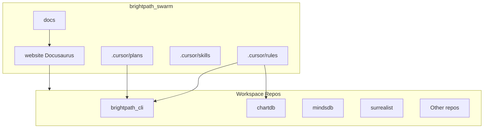

# Architecture — brightpath_swarm

Controller workspace for the Brightforest agent swarm: plans, rules, skills, and multi-repo
coordination.

## System Context

brightpath_swarm orchestrates AI agents across workspace repositories. It provides Cursor rules,
plans, skills, and documentation templates that guide agents and developers.

## Tech stack

- **Documentation**: Docusaurus 3.x (website/)
- **Sync**: Node script syncs markdown from workspace repos into docs/
- **Rules/Plans**: Markdown in .cursor/

## PathX Matcher E2E flows

Happy-path sequence: Flutter app → Firebase Cloud Functions → Modal/Prefect backend.

Source: [flutter-cloudfunctions-modal-flow.d2](flutter-cloudfunctions-modal-flow.d2). Regenerate:
`d2 docs/flutter-cloudfunctions-modal-flow.d2 docs/flutter-cloudfunctions-modal-flow.png`

**All 36 flow diagrams + summary page:**
[PathX Matcher — Architecture & Data Flows](pathx-matcher-flows-summary.md)

## See also

- [ARCHITECTURE.md](ARCHITECTURE.md) — Full AI Agent Crew system architecture
- [.cursor/rules/](../.cursor/rules/) — Coding standards and conventions
- [.cursor/plans/](../.cursor/plans/) — Plan files and roadmap
