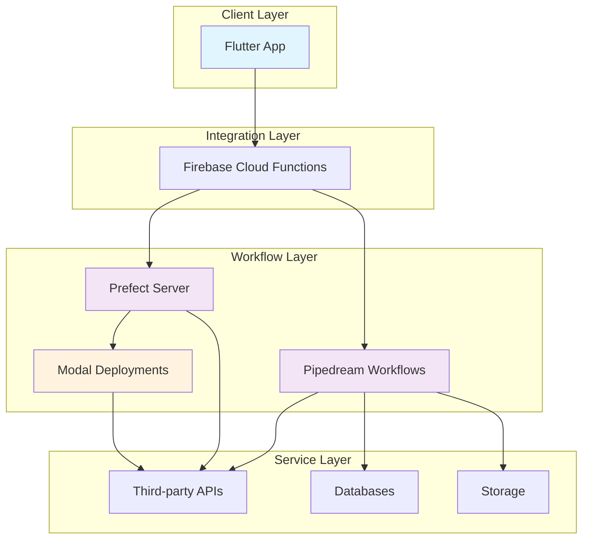

# PathX Matcher — End-to-End Data Flows & Architecture

Complete visual documentation of PathX Matcher's system architecture, featuring 36 sequence diagrams
covering all critical user journeys and integration points.

## System Overview

PathX Matcher connects Flutter mobile apps with backend orchestration through Firebase Cloud
Functions and workflow engines (Prefect, Pipedream), enabling seamless user-to-workflow automation.



## Complete Flow Diagram Index

### User Experience Flows (1-5)

| #      | Flow                    | Description                              | Start Point                            | End Point                |
| ------ | ----------------------- | ---------------------------------------- | -------------------------------------- | ------------------------ |
| **01** | `get-suggested-actions` | Complete action card generation pipeline | User query → Unified action cards      | Cards displayed in app   |
| **02** | `get-prefect-actions`   | Prefect-only action retrieval fallback   | Action request → Prefect API           | Fallback cards generated |
| **03** | `run-pipedream-action`  | Pipedream workflow execution             | Action selection → Pipedream execution | Success/error feedback   |
| **04** | `schedule-prefect-run`  | Schedule flow run via Prefect            | Schedule request → Prefect scheduling  | Schedule confirmation    |
| **05** | `get-prefect-flow-run`  | Individual flow run metadata             | Flow run ID → Prefect API              | Run details retrieved    |

### Flow Monitoring & Management (6-15)

| #      | Flow                           | Description                            | Purpose                     |
| ------ | ------------------------------ | -------------------------------------- | --------------------------- |
| **06** | `get-prefect-flow-run-logs`    | Structured log retrieval for debugging | Debug flow execution issues |
| **07** | `get-prefect-flow-run-graph`   | Visual DAG representation              | Understand execution paths  |
| **08** | `get-prefect-flow-run-input`   | Input parameters inspection            | Verify input data           |
| **09** | `cancel-prefect-run`           | Graceful flow run termination          | Stop long-running jobs      |
| **10** | `resume-prefect-run`           | Failed run restart capability          | Resume interrupted flows    |
| **11** | `trigger-prefect-run`          | Manual flow run initiation             | On-demand execution         |
| **12** | `set-prefect-flow-run-state`   | Runtime state manipulation             | Debug or override state     |
| **13** | `get-prefect-flow-run-history` | Complete execution lineage             | Audit trail analysis        |
| **14** | `get-prefect-scheduled-runs`   | Upcoming execution visibility          | Capacity planning           |
| **15** | `get-prefect-late-runs`        | Delayed execution detection            | SLA monitoring              |

### Deployment & Infrastructure Management (16-24)

| #      | Flow                               | Description                     | Operations                 |
| ------ | ---------------------------------- | ------------------------------- | -------------------------- |
| **16** | `get-prefect-deployments`          | Deployment inventory management | Catalog active deployments |
| **17** | `pause-prefect-deployment`         | Temporary service suspension    | Maintenance windows        |
| **18** | `resume-prefect-deployment`        | Service restoration             | Post-maintenance startup   |
| **19** | `get-prefect-deployment-schedules` | Schedule catalog browsing       | Automation oversight       |
| **20** | `create-prefect-schedule`          | New automation scheduling       | Event-driven workflows     |
| **21** | `update-prefect-schedule`          | Existing schedule modification  | Parameter tuning           |
| **22** | `delete-prefect-schedule`          | Schedule decommissioning        | Cleanup old automations    |
| **23** | `get-prefect-flows`                | Flow template discovery         | Available options catalog  |
| **24** | `get-prefect-server-status`        | Infrastructure health checks    | Operational readiness      |

### Integration & Connectivity (25-36)

| #      | Flow                                 | Description                      | Integration Points        |
| ------ | ------------------------------------ | -------------------------------- | ------------------------- |
| **25** | `connect-pipedream`                  | OAuth-based service linking      | Third-party auth flow     |
| **26** | `get-pipedream-connection-status`    | Connectivity health verification | Status dashboard          |
| **27** | `get-pipedream-connect-token`        | OAuth token initialization       | Secure API setup          |
| **28** | `disconnect-pipedream`               | Service unlinking                | Data cleanup              |
| **29** | `get-pipedream-suggested-actions`    | Pipedream workflow suggestions   | Alternative action source |
| **30** | `send-notification-firestore`        | Chat notification dispatch       | Real-time messaging       |
| **31** | `send-match-notification-firestore`  | Match event notifications        | User engagement           |
| **32** | `prefect-fallback-on-pipedream-fail` | Automatic service failover       | High availability         |
| **33** | `unauthenticated-error`              | Authentication failure handling  | Error recovery            |
| **34** | `prefect-api-error`                  | API integration error management | Fault tolerance           |
| **35** | `action-card-form-submit`            | Generic form submission handler  | Input validation          |
| **36** | `pipedream-token-refresh`            | OAuth token lifecycle management | Continuous operation      |

## Architecture Patterns

### Happy Path Flow

```
Flutter App → Firebase Functions → Prefect Proxy → Flow Execution → Success Response
     ↓              ↓                ↓             ↓           ↓
User Input →   Routing    →     Query Translation →  Run Flow  →  Update UI
```

### Fallback Flow

```
App Request → Primary Service (Timeout) → Fallback Service → Alternative Response
     ↓                ↓                      ↓             ↓
  Error 500    →   Pipedream Query     →   Prefect Exec   → Limited Features
```

### Error Handling Chain

```
Request → Try Primary → On Failure → Try Fallback → On Failure → Graceful Degradation
```

## Performance Characteristics

| Flow Category     | Typical Latency | Throughput    | SLA Target    |
| ----------------- | --------------- | ------------- | ------------- |
| Action Generation | <500ms          | 1000 req/sec  | 99.5% <2s     |
| Flow Execution    | <30s            | 100 req/sec   | 99.9% success |
| Flow Monitoring   | <200ms          | 10000 req/sec | 99.9% <1s     |
| OAuth Flows       | <5s             | 10 req/sec    | 95% <10s      |

## Reliability Patterns

### Circuit Breaker

- Automatic failure detection
- Graceful service degradation
- Recovery testing

### Retry Logic

- Exponential backoff
- Intelligent retry conditions
- Circuit breaker integration

### Monitoring & Alerting

- Latency and error rate tracking
- Automated threshold alerting
- Health check endpoints

## Security Considerations

### OAuth Token Management

- Encrypted storage at rest
- Secure token refresh flows
- Automatic token revocation

### API Request Validation

- Input sanitization
- Rate limiting
- Request signature verification

### Data Privacy

- End-to-end encryption
- Minimal data retention
- Audit logging

## Deployment Architecture

### Environment Isolation

```
Development → Staging → Production
      ↓          ↓          ↓
   Local Dev   Modal Test  Live Service
```

### Scaling Strategy

- Horizontal pod autoscaling
- Regional deployment
- CDN edge caching

## Observability Features

### Metrics Collection

- Request throughput and latency
- Error rates by endpoint
- Resource utilization

### Distributed Tracing

- End-to-end request tracking
- Performance bottleneck identification
- Service dependency mapping

### Log Aggregation

- Structured error logging
- Performance profiling data
- Audit trail generation

## Related Documentation

- [PathX Matcher — Data Model](../../docs/pathx-matcher-data-model.md)
- [PathX Matcher — API Reference](../../docs/pathx-matcher-api-reference.md)
- [PathX Matcher — Deployment Guide](../../docs/modal-deployment.md)
- [PathX Matcher — Flow Diagrams](../../flows/README.md)
- [Prefect Integration Guide](../../docs/prefect-integration.md)
- [Pipedream Integration Guide](../../docs/pipedream-integration.md)
